# MySQL 8.4 Handler API — Call Flows

Source: `mysql-server/sql/handler.h`, `mysql-server/sql/lock.cc`, `mysql-server/sql/handler.cc`

See also: [handler](handler.md) (148 virtual methods), [handlerton](handlerton.md) (74 callbacks)

## Statement Lifecycle (outer framing)

All SQL statements are wrapped in a lock/unlock frame.
The handler virtual methods in these frames are: `store_lock`, `external_lock`, `reset`.

### Normal mode

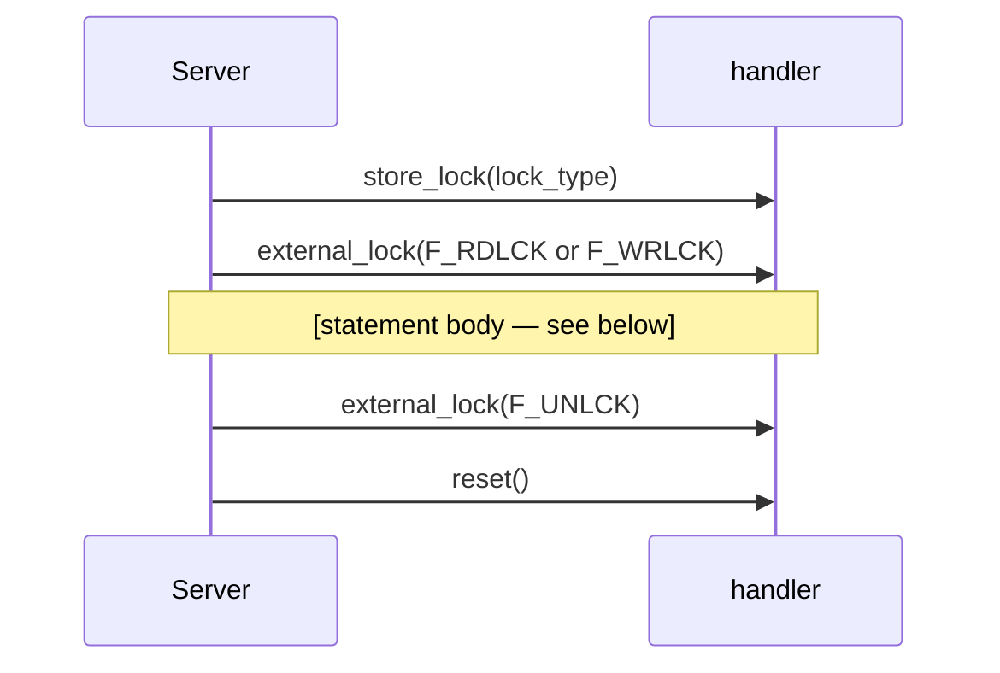
```mermaid
sequenceDiagram
    participant S as Server
    participant H as handler

    S->>H: store_lock(lock_type)
    S->>H: external_lock(F_RDLCK or F_WRLCK)
    Note over S,H: [statement body — see below]
    S->>H: external_lock(F_UNLCK)
    S->>H: reset()
```

### LOCK TABLES mode

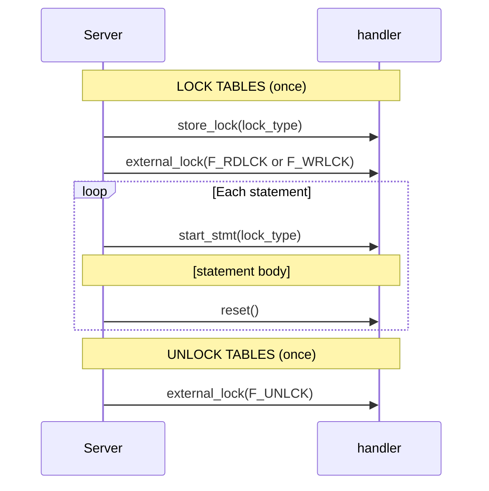
```mermaid
sequenceDiagram
    participant S as Server
    participant H as handler

    Note over S,H: LOCK TABLES (once)
    S->>H: store_lock(lock_type)
    S->>H: external_lock(F_RDLCK or F_WRLCK)

    loop Each statement
        S->>H: start_stmt(lock_type)
        Note over S,H: [statement body]
        S->>H: reset()
    end

    Note over S,H: UNLOCK TABLES (once)
    S->>H: external_lock(F_UNLCK)
```

## SELECT

### Full table scan

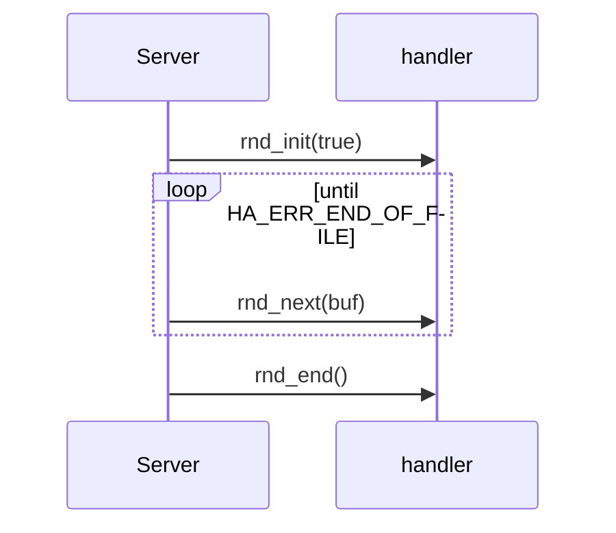
```mermaid
sequenceDiagram
    participant S as Server
    participant H as handler
    S->>H: rnd_init(true)
    loop until HA_ERR_END_OF_FILE
        S->>H: rnd_next(buf)
    end
    S->>H: rnd_end()
```

### Index scan (full / ordered)

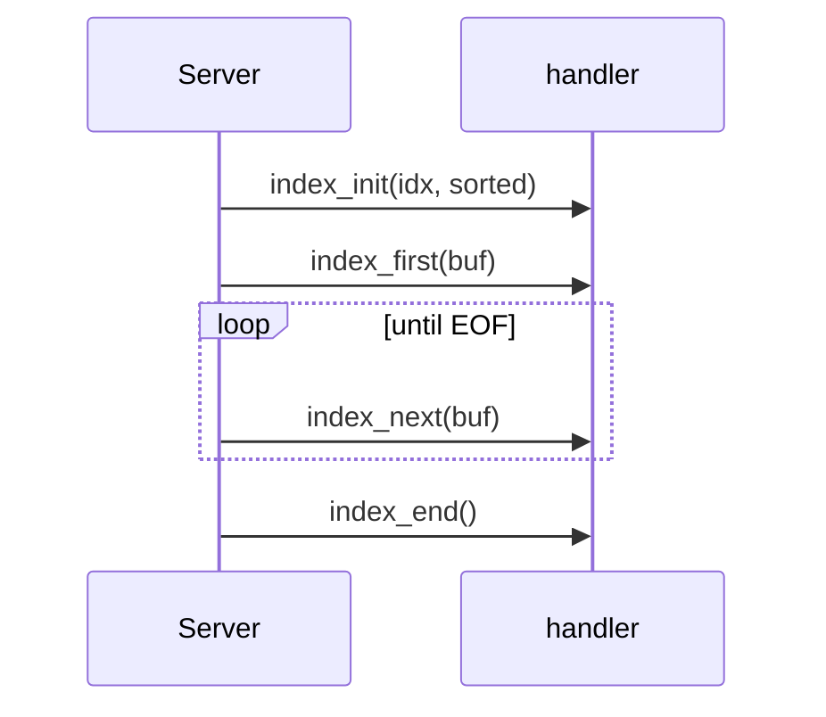
```mermaid
sequenceDiagram
    participant S as Server
    participant H as handler
    S->>H: index_init(idx, sorted)
    S->>H: index_first(buf)
    loop until EOF
        S->>H: index_next(buf)
    end
    S->>H: index_end()
```

Reverse scan uses `index_last` → `index_prev` instead.

### Index lookup (ref — non-unique key)

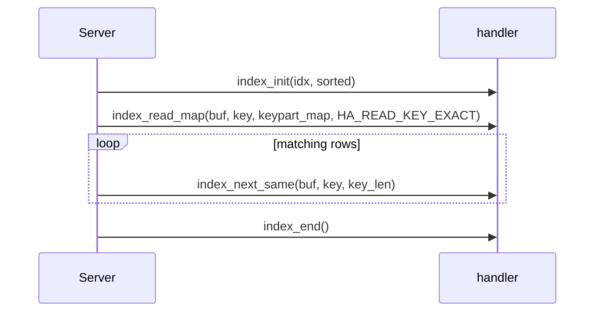
```mermaid
sequenceDiagram
    participant S as Server
    participant H as handler
    S->>H: index_init(idx, sorted)
    S->>H: index_read_map(buf, key, keypart_map, HA_READ_KEY_EXACT)
    loop matching rows
        S->>H: index_next_same(buf, key, key_len)
    end
    S->>H: index_end()
```

### Unique index lookup (eq_ref)

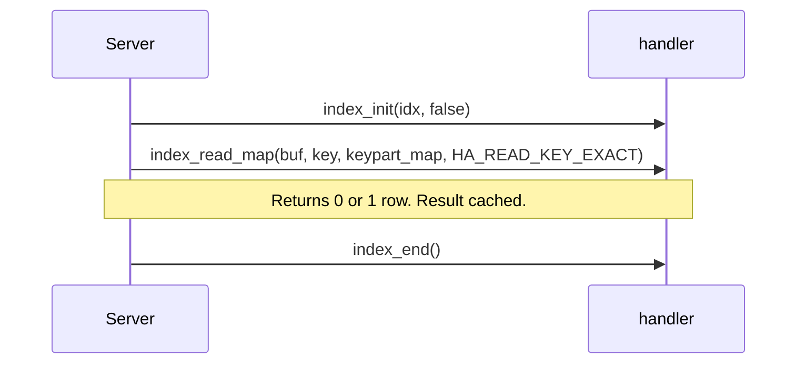
```mermaid
sequenceDiagram
    participant S as Server
    participant H as handler
    S->>H: index_init(idx, false)
    S->>H: index_read_map(buf, key, keypart_map, HA_READ_KEY_EXACT)
    Note over S,H: Returns 0 or 1 row. Result cached.
    S->>H: index_end()
```

### Range scan

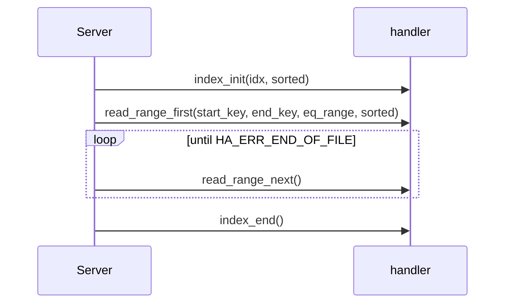
```mermaid
sequenceDiagram
    participant S as Server
    participant H as handler
    S->>H: index_init(idx, sorted)
    S->>H: read_range_first(start_key, end_key, eq_range, sorted)
    loop until HA_ERR_END_OF_FILE
        S->>H: read_range_next()
    end
    S->>H: index_end()
```

### Multi-Range Read (MRR)

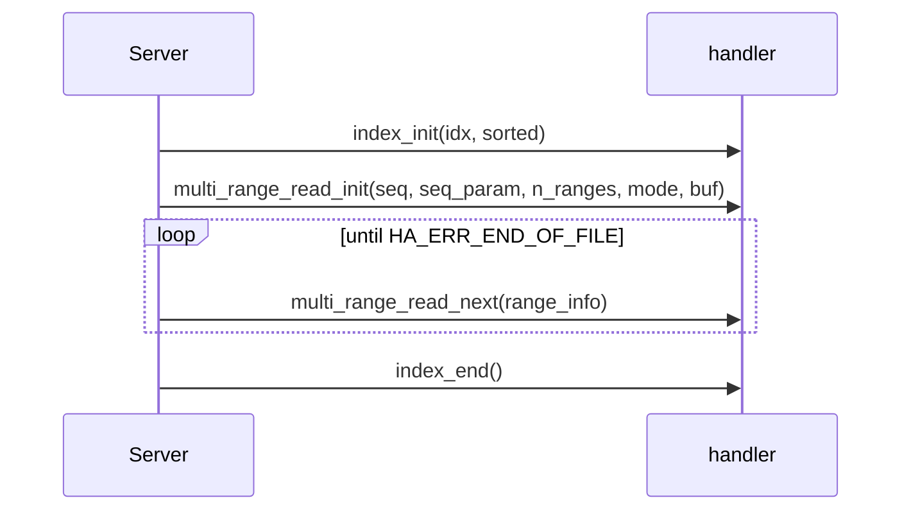
```mermaid
sequenceDiagram
    participant S as Server
    participant H as handler
    S->>H: index_init(idx, sorted)
    S->>H: multi_range_read_init(seq, seq_param, n_ranges, mode, buf)
    loop until HA_ERR_END_OF_FILE
        S->>H: multi_range_read_next(range_info)
    end
    S->>H: index_end()
```

Cost estimation before MRR:

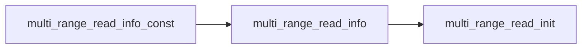
```mermaid
flowchart LR
    multi_range_read_info_const --> multi_range_read_info --> multi_range_read_init
```

### Full-text search

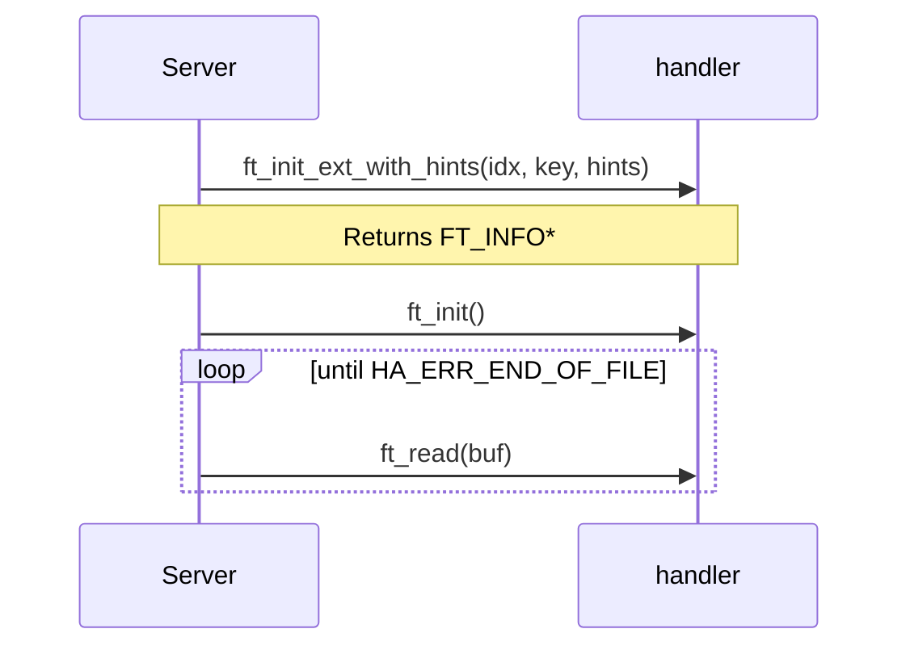
```mermaid
sequenceDiagram
    participant S as Server
    participant H as handler
    S->>H: ft_init_ext_with_hints(idx, key, hints)
    Note over S,H: Returns FT_INFO*
    S->>H: ft_init()
    loop until HA_ERR_END_OF_FILE
        S->>H: ft_read(buf)
    end
```

### Sampling (TABLESAMPLE)

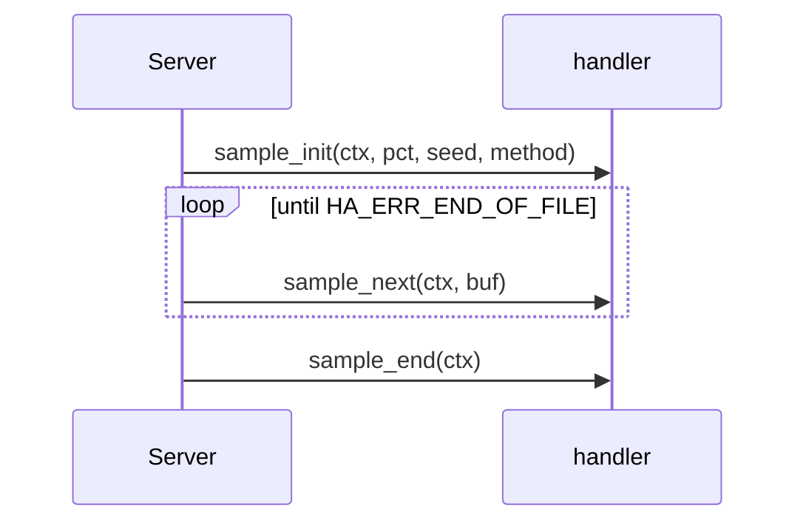
```mermaid
sequenceDiagram
    participant S as Server
    participant H as handler
    S->>H: sample_init(ctx, pct, seed, method)
    loop until HA_ERR_END_OF_FILE
        S->>H: sample_next(ctx, buf)
    end
    S->>H: sample_end(ctx)
```

### Parallel scan

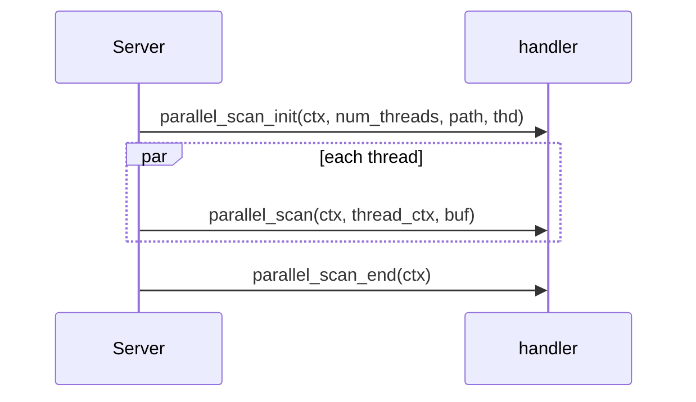
```mermaid
sequenceDiagram
    participant S as Server
    participant H as handler
    S->>H: parallel_scan_init(ctx, num_threads, path, thd)
    par each thread
        S->>H: parallel_scan(ctx, thread_ctx, buf)
    end
    S->>H: parallel_scan_end(ctx)
```

## INSERT

### INSERT VALUES (single / multi-row)

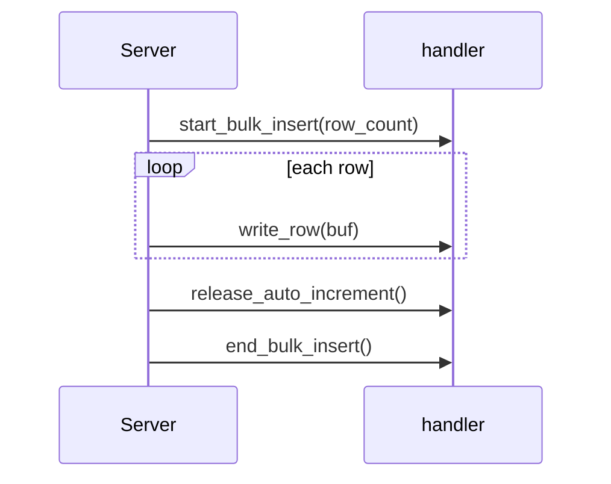
```mermaid
sequenceDiagram
    participant S as Server
    participant H as handler
    S->>H: start_bulk_insert(row_count)
    loop each row
        S->>H: write_row(buf)
    end
    S->>H: release_auto_increment()
    S->>H: end_bulk_insert()
```

`start_bulk_insert(row_count)` passes the exact number of rows for VALUES,
or `0` when the count is unknown (INSERT ... SELECT, LOAD DATA).

### INSERT ... SELECT

Same as above but `start_bulk_insert(0)`.

### INSERT ... ON DUPLICATE KEY UPDATE

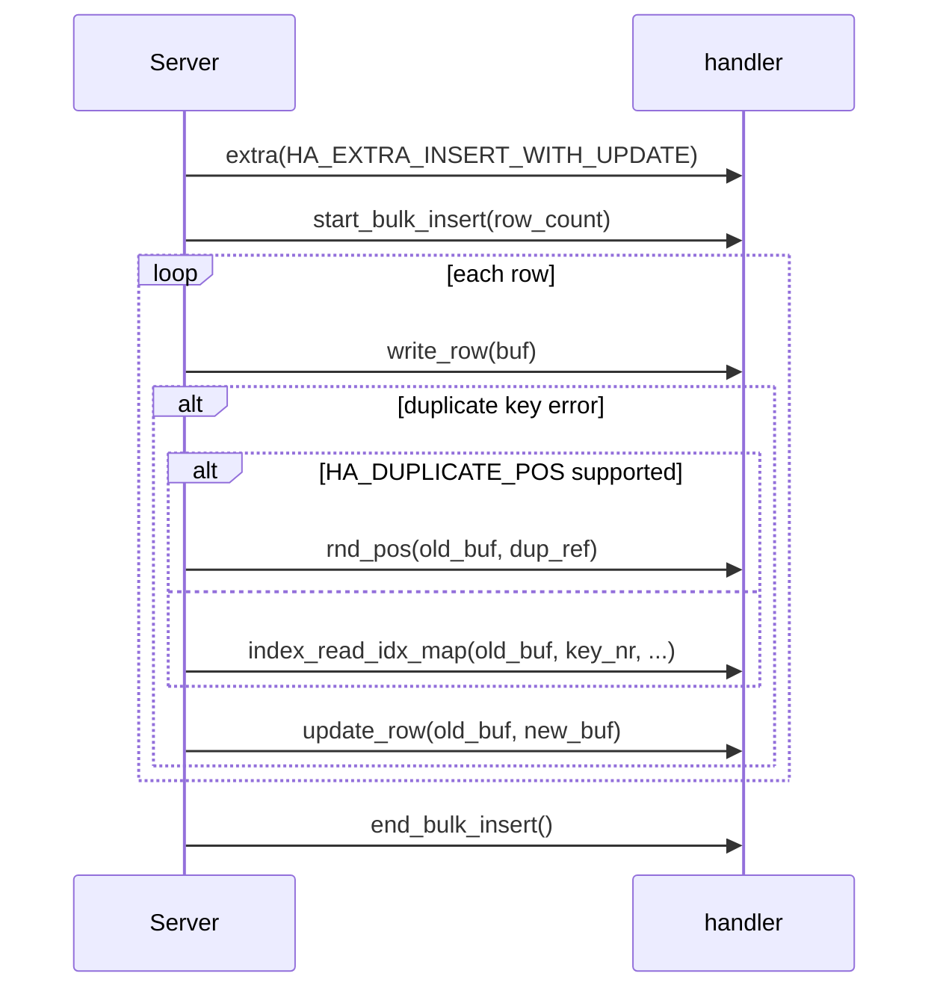
```mermaid
sequenceDiagram
    participant S as Server
    participant H as handler
    S->>H: extra(HA_EXTRA_INSERT_WITH_UPDATE)
    S->>H: start_bulk_insert(row_count)
    loop each row
        S->>H: write_row(buf)
        alt duplicate key error
            alt HA_DUPLICATE_POS supported
                S->>H: rnd_pos(old_buf, dup_ref)
            else
                S->>H: index_read_idx_map(old_buf, key_nr, ...)
            end
            S->>H: update_row(old_buf, new_buf)
        end
    end
    S->>H: end_bulk_insert()
```

### REPLACE

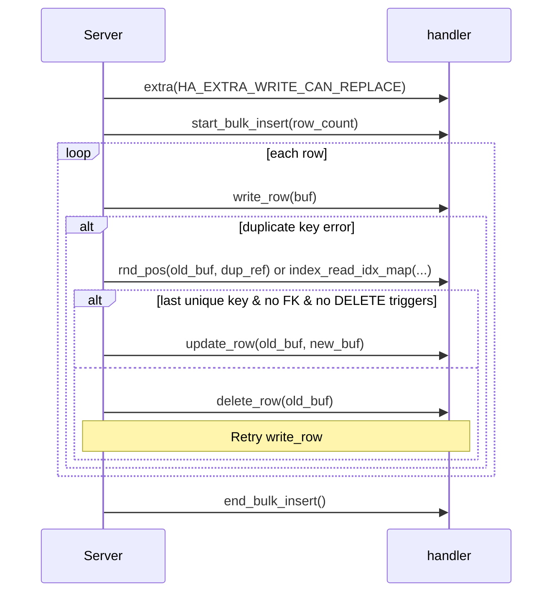
```mermaid
sequenceDiagram
    participant S as Server
    participant H as handler
    S->>H: extra(HA_EXTRA_WRITE_CAN_REPLACE)
    S->>H: start_bulk_insert(row_count)
    loop each row
        S->>H: write_row(buf)
        alt duplicate key error
            S->>H: rnd_pos(old_buf, dup_ref) or index_read_idx_map(...)
            alt last unique key & no FK & no DELETE triggers
                S->>H: update_row(old_buf, new_buf)
            else
                S->>H: delete_row(old_buf)
                Note over S,H: Retry write_row
            end
        end
    end
    S->>H: end_bulk_insert()
```

### LOAD DATA INFILE

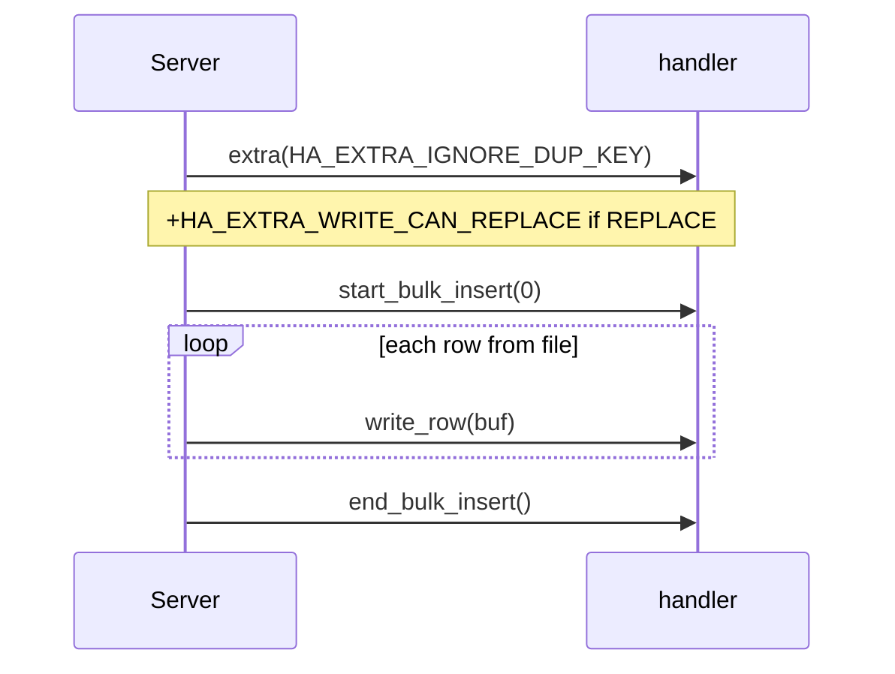
```mermaid
sequenceDiagram
    participant S as Server
    participant H as handler
    S->>H: extra(HA_EXTRA_IGNORE_DUP_KEY)
    Note over S,H: +HA_EXTRA_WRITE_CAN_REPLACE if REPLACE
    S->>H: start_bulk_insert(0)
    loop each row from file
        S->>H: write_row(buf)
    end
    S->>H: end_bulk_insert()
```

## UPDATE

### Full table scan UPDATE

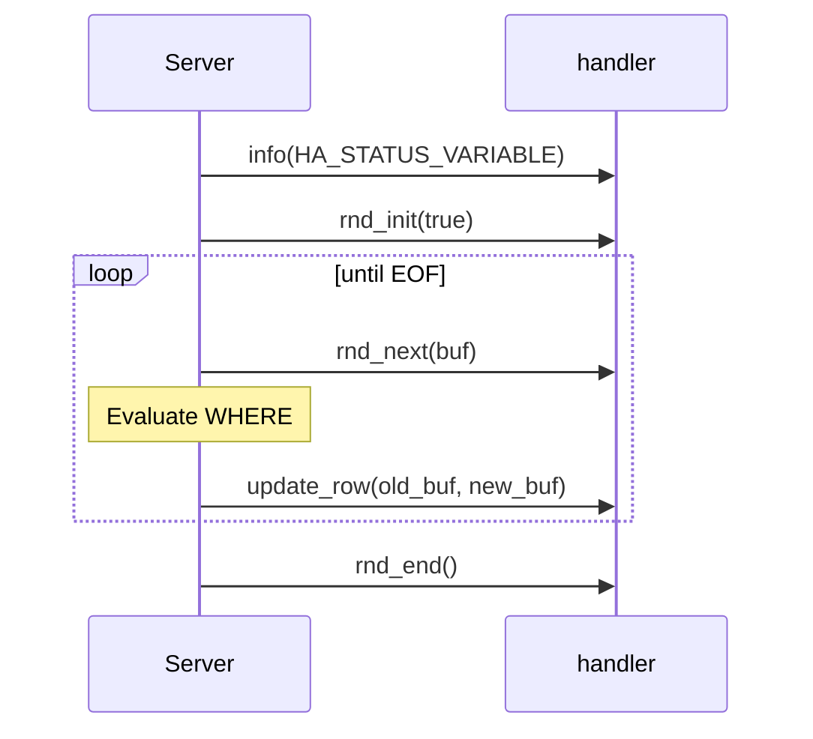
```mermaid
sequenceDiagram
    participant S as Server
    participant H as handler
    S->>H: info(HA_STATUS_VARIABLE)
    S->>H: rnd_init(true)
    loop until EOF
        S->>H: rnd_next(buf)
        Note over S: Evaluate WHERE
        S->>H: update_row(old_buf, new_buf)
    end
    S->>H: rnd_end()
```

### Index scan UPDATE

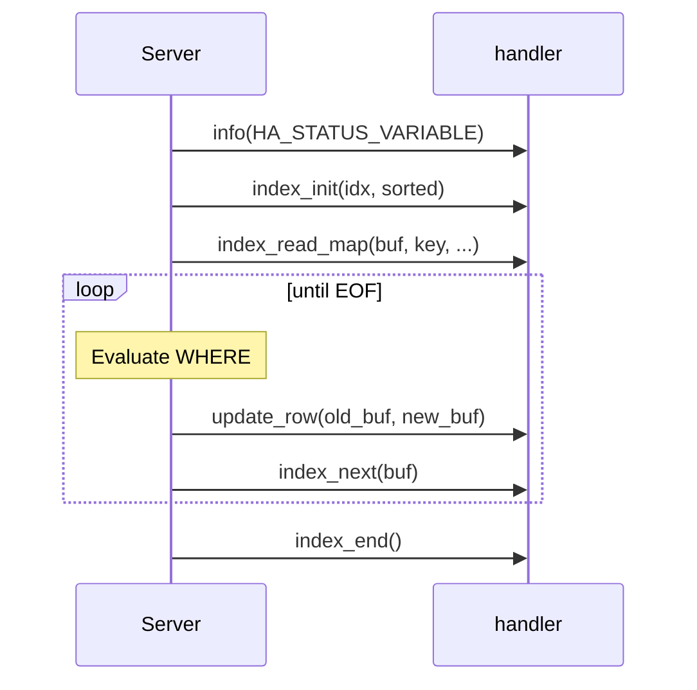
```mermaid
sequenceDiagram
    participant S as Server
    participant H as handler
    S->>H: info(HA_STATUS_VARIABLE)
    S->>H: index_init(idx, sorted)
    S->>H: index_read_map(buf, key, ...)
    loop until EOF
        Note over S: Evaluate WHERE
        S->>H: update_row(old_buf, new_buf)
        S->>H: index_next(buf)
    end
    S->>H: index_end()
```

### Two-pass UPDATE (ORDER BY on modified key)

When UPDATE modifies the index being used for scanning, a two-pass strategy is used:

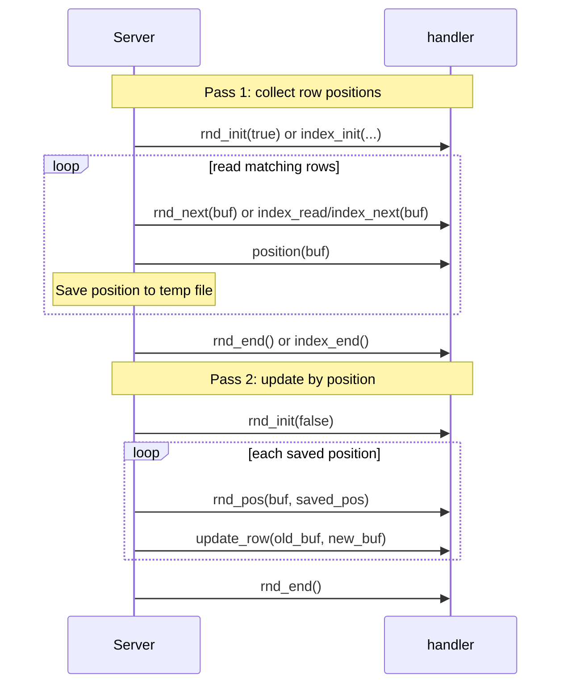
```mermaid
sequenceDiagram
    participant S as Server
    participant H as handler
    Note over S,H: Pass 1: collect row positions
    S->>H: rnd_init(true) or index_init(...)
    loop read matching rows
        S->>H: rnd_next(buf) or index_read/index_next(buf)
        S->>H: position(buf)
        Note over S: Save position to temp file
    end
    S->>H: rnd_end() or index_end()

    Note over S,H: Pass 2: update by position
    S->>H: rnd_init(false)
    loop each saved position
        S->>H: rnd_pos(buf, saved_pos)
        S->>H: update_row(old_buf, new_buf)
    end
    S->>H: rnd_end()
```

### Bulk UPDATE (no AFTER UPDATE triggers)

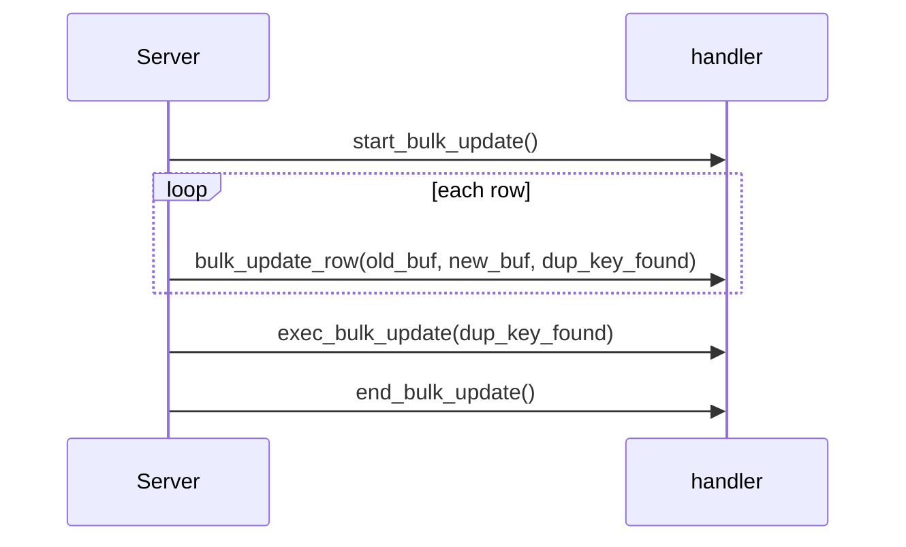
```mermaid
sequenceDiagram
    participant S as Server
    participant H as handler
    S->>H: start_bulk_update()
    loop each row
        S->>H: bulk_update_row(old_buf, new_buf, dup_key_found)
    end
    S->>H: exec_bulk_update(dup_key_found)
    S->>H: end_bulk_update()
```

## DELETE

### Full table scan DELETE

```mermaid
sequenceDiagram
    participant S as Server
    participant H as handler
    S->>H: info(HA_STATUS_VARIABLE)
    S->>H: rnd_init(true)
    loop until EOF
        S->>H: rnd_next(buf)
        Note over S: Evaluate WHERE
        S->>H: delete_row(buf)
    end
    S->>H: rnd_end()
```

### Index scan DELETE

```mermaid
sequenceDiagram
    participant S as Server
    participant H as handler
    S->>H: info(HA_STATUS_VARIABLE)
    S->>H: index_init(idx, sorted)
    S->>H: index_read_map(buf, key, ...)
    loop until EOF
        Note over S: Evaluate WHERE
        S->>H: delete_row(buf)
        S->>H: index_next(buf)
    end
    S->>H: index_end()
```

### DELETE FROM table (no WHERE — optimized)

When there is no WHERE clause, no LIMIT, no triggers, and no FK constraints:

```mermaid
flowchart LR
    delete_all_rows
```

Skips per-row iteration entirely.

### Bulk DELETE (no AFTER DELETE triggers)

```mermaid
sequenceDiagram
    participant S as Server
    participant H as handler
    S->>H: start_bulk_delete()
    loop each row
        S->>H: delete_row(buf)
    end
    S->>H: end_bulk_delete()
```

## DDL

### CREATE TABLE

```mermaid
flowchart LR
    create --> open --> external_lock --> external_lock2["external_lock(F_UNLCK)"] --> close
```

Server creates the DD entry, then calls `ha_create()` for on-disk files.

### DROP TABLE

```mermaid
flowchart LR
    delete_table
```

Handler deletes engine files. DD entry removed separately by server.

### TRUNCATE TABLE

```mermaid
flowchart LR
    truncate
```

Table is already open via `open_and_lock_tables`.
Some engines implement truncate as drop + re-create internally.

### RENAME TABLE

```mermaid
flowchart LR
    rename_table
```

Handler renames engine files. DD entry updated separately.

### ALTER TABLE (copy algorithm)

```mermaid
sequenceDiagram
    participant S as Server
    participant Old as handler (old)
    participant New as handler (new)
    S->>New: create(temp_name)
    S->>Old: info(HA_STATUS_VARIABLE)
    S->>New: start_bulk_insert(row_count)
    loop each row from old table
        S->>Old: rnd_next(buf) or index_next(buf)
        S->>New: write_row(buf)
    end
    S->>New: end_bulk_insert()
    S->>New: external_lock(F_UNLCK)
    Note over S: rename temp → final, drop old
    S->>New: rename_table(temp, final)
```

### ALTER TABLE (in-place)

```mermaid
flowchart LR
    check_if_supported_inplace_alter -->|HA_ALTER_INPLACE_*| prepare_inplace_alter_table
    prepare_inplace_alter_table --> inplace_alter_table
    inplace_alter_table --> commit_inplace_alter_table
    commit_inplace_alter_table --> notify_table_changed
```

### ALTER TABLE (instant)

Same call path as in-place. `check_if_supported_inplace_alter` returns
`HA_ALTER_INPLACE_INSTANT`. The engine performs metadata-only changes in
`commit_inplace_alter_table`. No data is touched.

```mermaid
flowchart LR
    check_if_supported_inplace_alter -->|HA_ALTER_INPLACE_INSTANT| prepare_inplace_alter_table
    prepare_inplace_alter_table --> inplace_alter_table
    inplace_alter_table --> commit_inplace_alter_table
    commit_inplace_alter_table --> notify_table_changed
```

## Admin Operations

### CHECK / REPAIR / OPTIMIZE / ANALYZE TABLE

```mermaid
sequenceDiagram
    participant S as Server
    participant H as handler
    Note over S,H: Table opened and locked via open_and_lock_tables
    S->>H: check(thd, check_opt)
    Note over S,H: or repair() / optimize() / analyze()
```

These return `HA_ADMIN_OK`, `HA_ADMIN_NEEDS_UPGRADE`, `HA_ADMIN_TRY_ALTER`, etc.
On `HA_ADMIN_TRY_ALTER`, the server performs `ALTER TABLE ... FORCE` internally.

### HANDLER SQL Command

```mermaid
sequenceDiagram
    participant S as Server
    participant H as handler
    Note over S,H: HANDLER OPEN
    S->>H: init_table_handle_for_HANDLER()

    Note over S,H: HANDLER READ (index access)
    S->>H: index_init(keyno, sorted)
    S->>H: index_first(buf) or index_read_map(buf, key, ...)
    loop HANDLER READ NEXT
        S->>H: index_next(buf) or index_prev(buf)
    end
    S->>H: index_end()

    Note over S,H: HANDLER READ (table scan)
    S->>H: rnd_init(true)
    loop HANDLER READ NEXT
        S->>H: rnd_next(buf)
    end
    S->>H: rnd_end()

    Note over S,H: HANDLER CLOSE
    S->>H: close()
```

## Transaction Management (handlerton callbacks)

### Implicit / Explicit COMMIT

```mermaid
sequenceDiagram
    participant S as Server
    participant HT as handlerton
    Note over S,HT: For single-engine transactions
    S->>HT: commit(thd, all=true)
```

### ROLLBACK

```mermaid
sequenceDiagram
    participant S as Server
    participant HT as handlerton
    S->>HT: rollback(thd, all=true)
```

### Savepoints

```mermaid
sequenceDiagram
    participant S as Server
    participant HT as handlerton
    S->>HT: savepoint_set(thd, savepoint)
    Note over S,HT: ... operations ...
    alt ROLLBACK TO SAVEPOINT
        S->>HT: savepoint_rollback(thd, savepoint)
    end
    alt RELEASE SAVEPOINT
        S->>HT: savepoint_release(thd, savepoint)
    end
```

### XA / Two-Phase Commit (2PC)

```mermaid
sequenceDiagram
    participant S as Server
    participant HT as handlerton
    Note over S,HT: Normal 2PC
    S->>HT: prepare(thd, all=true)
    S->>HT: commit(thd, all=true)

    Note over S,HT: Crash recovery
    S->>HT: recover(xid_list, len)
    alt found prepared transactions
        S->>HT: commit_by_xid(xid)
    else
        S->>HT: rollback_by_xid(xid)
    end
```

## Connection Lifecycle (handlerton)

```mermaid
flowchart LR
    init["init (plugin init)"] --> create["create (per table open)"]
    create --> close_connection
    close_connection --> deinit["deinit (plugin deinit)"]
```

## Optimizer & Pushdown

### Condition Pushdown

```mermaid
flowchart LR
    cond_push --> scan["scan operations"] --> ha_reset["reset() clears pushed_cond"]
```

Engine evaluates pushed conditions internally during scan.
Returns remainder condition that server must still evaluate.

### Index Condition Pushdown (ICP)

```mermaid
flowchart LR
    idx_cond_push --> index_read["index_read / index_next with ICP"] --> cancel_pushed_idx_cond
```

Handler evaluates index condition before fetching full row.
`cancel_pushed_idx_cond` called by `reset()` at statement end.

### Pushed Joins (NDB only)

```mermaid
sequenceDiagram
    participant S as Server
    participant H as handler
    S->>H: index_read_pushed(buf, key, keypart_map)
    loop child rows
        S->>H: index_next_pushed(buf)
    end
```

Query methods: `number_of_pushed_joins`, `member_of_pushed_join`,
`parent_of_pushed_join`, `tables_in_pushed_join`.

## Other Features

### Read Removal (UPDATE/DELETE optimization)

```mermaid
flowchart LR
    start_read_removal --> update_delete["update_row / delete_row"] --> end_read_removal
```

Handler skips reading row before write when safe (unique index, full key used).
`end_read_removal` returns the actual number of affected rows.

### Bulk Load

```mermaid
sequenceDiagram
    participant S as Server
    participant H as handler
    S->>H: bulk_load_check(thd)
    S->>H: bulk_load_begin(thd, data_size, memory, num_threads)
    par each thread
        loop data chunks
            S->>H: bulk_load_execute(thd, ctx, thread_idx, rows, callbacks)
        end
    end
    S->>H: bulk_load_end(thd, ctx, is_error)
```

### Secondary Engine (SECONDARY_LOAD / SECONDARY_UNLOAD)

```mermaid
flowchart LR
    load_table["load_table (ALTER TABLE ... SECONDARY_LOAD)"]
    unload_table["unload_table (ALTER TABLE ... SECONDARY_UNLOAD)"]
```

### Clone

Clone uses handlerton-level callbacks, not handler virtual methods.

```mermaid
sequenceDiagram
    participant D as Donor
    participant R as Recipient
    D->>D: clone_begin()
    R->>R: clone_apply_begin()
    loop data transfer
        D->>D: clone_copy()
        D->>D: clone_ack()
        R->>R: clone_apply()
    end
    D->>D: clone_end()
    R->>R: clone_apply_end()
```

### DISCARD / IMPORT TABLESPACE

```mermaid
flowchart LR
    discard["discard_or_import_tablespace(true) — DISCARD"]
    import["discard_or_import_tablespace(false) — IMPORT"]
```

### Auto-Increment

```mermaid
flowchart LR
    get_auto_increment --> write_row --> release_auto_increment
```

`get_auto_increment` called when server needs the next value.
`release_auto_increment` called after statement to return unused reserved values.

### Index Enable / Disable (HEAP, MyISAM only)

```mermaid
flowchart LR
    disable_indexes --> enable_indexes
```

### extra() Hints

`extra(ha_extra_function)` is called by the server at various points to pass hints.
Key flags and when they are sent:

| Flag | When |
| ---- | ---- |
| `HA_EXTRA_WRITE_CAN_REPLACE` | Before REPLACE |
| `HA_EXTRA_INSERT_WITH_UPDATE` | Before INSERT ... ON DUPLICATE KEY UPDATE |
| `HA_EXTRA_IGNORE_DUP_KEY` | Before IGNORE statements |
| `HA_EXTRA_UPDATE_CANNOT_BATCH` | When AFTER UPDATE triggers exist |
| `HA_EXTRA_DELETE_CANNOT_BATCH` | When AFTER DELETE triggers exist |
| `HA_EXTRA_QUICK` | Hint for DELETE with index |
| `HA_EXTRA_NO_IGNORE_DUP_KEY` | Reset in `reset()` |
| `HA_EXTRA_WRITE_CANNOT_REPLACE` | Reset in `reset()` |

### info() Flags

`info(uint flag)` is called to request engine statistics.

| Flag | When |
| ---- | ---- |
| `HA_STATUS_VARIABLE` | Before UPDATE/DELETE, SHOW, I_S queries |
| `HA_STATUS_CONST` | After ANALYZE TABLE |
| `HA_STATUS_AUTO` | During ALTER TABLE (auto-increment) |
| `HA_STATUS_ERRKEY` | After duplicate key error |
| `HA_STATUS_TIME` | For INFORMATION_SCHEMA |
| `HA_STATUS_NO_LOCK` | Combined with above; don't acquire lock |

---

## Summary

| Interface | Total | Pure Virtual / Required | With Default |
| --------- | ----- | ----------------------- | ------------ |
| handlerton | 74 | 1 (`create`) | 73 |
| handler | 148 | 12 | 136 |
| **Total** | **222** | **13** | **209** |
