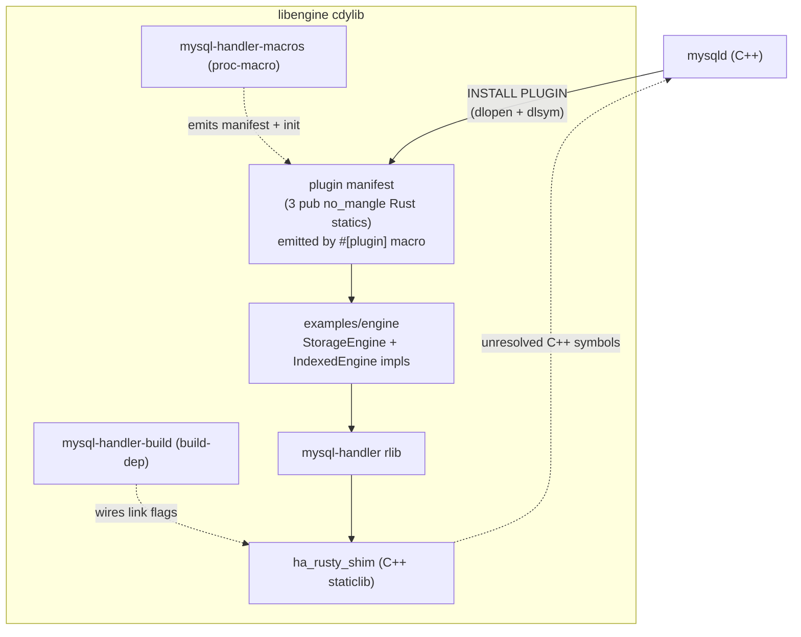
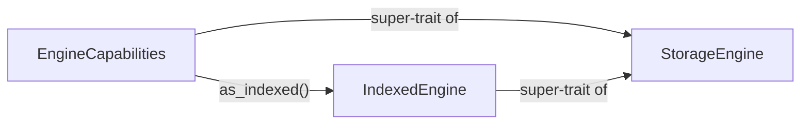

# Architecture

## Layers

## Capability dispatcher

`StorageEngine` carries the always-present surface; optional behaviour
lives on sub-traits reached through `EngineCapabilities::as_<sub-trait>()`,
which defaults to `None` and is overridden via `#[plugin]`'s
`capabilities = [...]` list. New sub-traits land alongside their first
method — no empty marker traits.

## Pointer-based delegation

`RustHandlerBase` lives in MySQL-owned memory (`new (mem_root)`); the
Rust engine state lives on the Rust heap as an `EngineContext` wrapping
`Box<dyn EngineCapabilities>`, reached through `void* rust_ctx_`.
`rust__create_engine` / `rust__destroy_engine` keep the two lifetimes
aligned.

## Plugin manifest in Rust

mysqld dlsyms three data symbols at `INSTALL PLUGIN`
(`_mysql_plugin_interface_version_`, `_mysql_sizeof_struct_st_plugin_`,
`_mysql_plugin_declarations_`). The `#[plugin]` macro emits them as
`#[unsafe(no_mangle)] pub static` on the downstream cdylib plus the
panic-safe `rust__plugin_init` the shim calls back into. Hosting them
in Rust is the only Linux-ELF export path that survives the cdylib's
auto-generated version script.

## Naming convention

| Direction | Pattern | Example |
| --- | --- | --- |
| C++ → Rust | `rust__handler__<method>` | `rust__handler__rnd_next` |
| Rust → C++ | `mysql__<Class>__<method>` | `mysql__TABLE__field_count` |

## Hybrid bindgen

bindgen handles enums and constants only; FFI function declarations are
hand-written. `src/sys_bindings.rs` is committed, so `cargo check` /
`cargo test` need no MySQL headers — headers are only consumed by
`build.rs` under `MYSQL_HANDLER_REGEN_BINDINGS=1`.

## Build modes

| Trigger | Behaviour |
| --- | --- |
| `MYSQL_HANDLER_FROM_SOURCE=1` | cmake-build `libha_rusty_shim.a` from `shim/` against `mysql-server/` |
| `MYSQL_HANDLER_ARCHIVE=<path>` | gunzip the named archive into `OUT_DIR/prebuilt/libha_rusty_shim.a` |
| (unset) | No shim link — `cargo check` / `cargo test` only, not loadable |

`build.rs` never reaches the network.

## Safety invariants

- Every `extern "C"` callback wraps its body in `ffi_boundary()`; a
  panic across the FFI boundary aborts mysqld.
- MySQL-owned pointers (`TABLE*`, `Field*`, `THD*`) are never stored
  beyond the callback that received them.
- C++ classes are represented in Rust as `#[repr(C)] struct Foo([u8; 0])`.
- Shared layouts are guarded by `static_assert` in `shim/binding.cc`.

## E2E smoke

Two-stage Docker build: the builder produces `libengine.so` against a
prebuilt MySQL 8.4 source tree; the runtime is `mysql:8.4.9` with the
plugin staged into `plugin_dir`. Runs on x86_64 and arm64.
