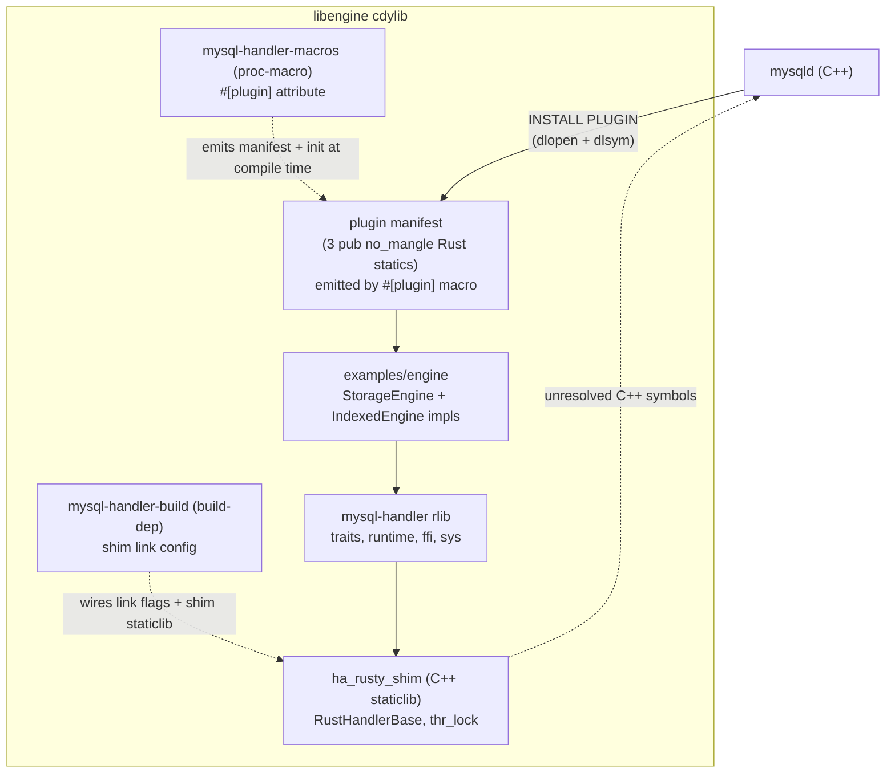
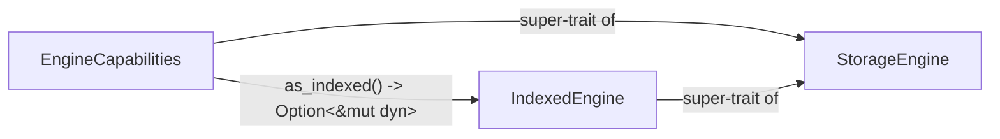

# Architecture

## Layers

- **`src/`** is the `mysql-handler` rlib. It hosts the bindgen output
  (`sys.rs`), the `StorageEngine` / `IndexedEngine` /
  `EngineCapabilities` traits, the `ffi_boundary()` `catch_unwind`
  wrappers, and one Rust callback per handler / handlerton method.
- **`mysql-handler-macros/`** is a `proc-macro = true` crate hosting the
  `#[plugin]` attribute. The macro is re-exported through
  `mysql_handler::prelude` so downstream crates depend on it
  transitively.
- **`mysql-handler-build/`** is a zero-dependency build-script helper.
  Downstream `build.rs` calls a single `mysql_handler_build::configure()`
  to emit the `rustc-link-*` directives needed to resolve the C++ shim
  and platform stdlib at link time.
- **`shim/`** is a C++ staticlib (`libha_rusty_shim.a`). It subclasses
  `handler` and forwards each virtual method to a `rust__handler__*`
  callback.
- **`examples/engine/`** is a downstream cdylib serving double duty as
  the reference engine and the e2e smoke target. It consumes all three
  workspace crates exactly the way an external user would.

## Capability dispatcher

`StorageEngine` carries the always-present surface (open, close, full
table scan, row CRUD, statistics, locking, hints). Engine-optional
behaviour lives on sub-traits the engine opts into; the FFI boundary
reaches them through `EngineCapabilities::as_<sub-trait>()`, which
defaults to `None` and is overridden via the `#[plugin]` attribute's
`capabilities = [...]` list.

A `StorageEngine`-only impl produces a heap-table-equivalent engine
(scans only). Adding `impl IndexedEngine for MyEngine { ... }` plus
`capabilities = [Indexed]` makes the optimizer reach the index
callbacks. Additional capability identifiers are introduced alongside
the first method of each new sub-trait — no empty marker traits.

## Pointer-based delegation

`RustHandlerBase` lives in MySQL-owned memory (`new (mem_root)`). The
Rust engine state lives on the Rust heap as an `EngineContext` wrapping
`Box<dyn EngineCapabilities>`, reached through `void* rust_ctx_`. The
C++ constructor and destructor call `rust__create_engine` /
`rust__destroy_engine` to keep the two lifetimes aligned, so neither
side ever frees memory it does not own.

## Plugin manifest in Rust

mysqld looks up three data symbols at `INSTALL PLUGIN`:

- `_mysql_plugin_interface_version_`
- `_mysql_sizeof_struct_st_plugin_`
- `_mysql_plugin_declarations_`

The `#[plugin]` macro emits these as `#[unsafe(no_mangle)] pub static`
on the downstream cdylib at compile time, alongside an opaque
`__mysql_handler_plugin` module that holds the manifest layout. On
Linux ELF, Rust's auto-generated cdylib version script wraps every
non-`pub no_mangle` symbol in `local: *;` — a C++ definition would be
stripped from `.dynsym` and become invisible to `dlsym`. Hosting the
manifest in Rust is the only export path that works on Linux without
per-platform linker hacks. The same `#[plugin]` invocation generates
the panic-safe `rust__plugin_init` that the shim calls back into to
register the engine factory (and an optional `handlerton`).

## Naming convention

| Direction | Pattern | Example |
| --- | --- | --- |
| C++ → Rust | `rust__handler__<method>` | `rust__handler__rnd_next` |
| Rust → C++ | `mysql__<Class>__<method>` | `mysql__TABLE__field_count` |

## Hybrid bindgen

bindgen is used for enums and constants only. FFI function declarations
are hand-written. The committed `src/sys_bindings.rs` means `cargo check`
and `cargo test` need no MySQL headers — the headers are only consumed
by `build.rs` when `MYSQL_HANDLER_REGEN_BINDINGS=1` is set.

## Build modes

`cargo build --release -p engine` produces the final cdylib. The C++ shim
selection is env-driven:

| Trigger | Behaviour |
| --- | --- |
| `MYSQL_HANDLER_FROM_SOURCE=1` | cmake-build `libha_rusty_shim.a` from `shim/` against the `mysql-server/` submodule |
| `MYSQL_HANDLER_ARCHIVE=<path>` | gunzip the named archive into `OUT_DIR/prebuilt/libha_rusty_shim.a` (local filesystem only) |
| (unset) | No shim link — fine for `cargo check` / `cargo test`, not loadable into mysqld |

`build.rs` never reaches the network — external assets come via the
`mysql-server/` submodule, the Nix shell, or a local archive.

## Safety invariants

- Every `extern "C"` callback wraps its body in `ffi_boundary()`. A
  panic across the FFI boundary would abort the entire MySQL server.
- MySQL-owned pointers (`TABLE*`, `Field*`, `THD*`) are never stored
  beyond the scope of the callback that received them.
- C++ classes are represented in Rust as opaque types
  (`#[repr(C)] struct Foo([u8; 0])`).
- Struct sizes and alignments are verified with `static_assert` in
  `shim/binding.cc` for every shared layout.

## E2E smoke

The Smoke CI job runs a two-stage Docker build. The builder produces
`libengine.so` against a prebuilt MySQL 8.4 source tree; the runtime is
`mysql:8.4.9` with the plugin staged into `plugin_dir`. The end-to-end
SQL exercises the full plugin load path, schema creation, row CRUD with
equality lookups, and the engine's sentinel return value. The runtime
image runs on both x86_64 and arm64.
