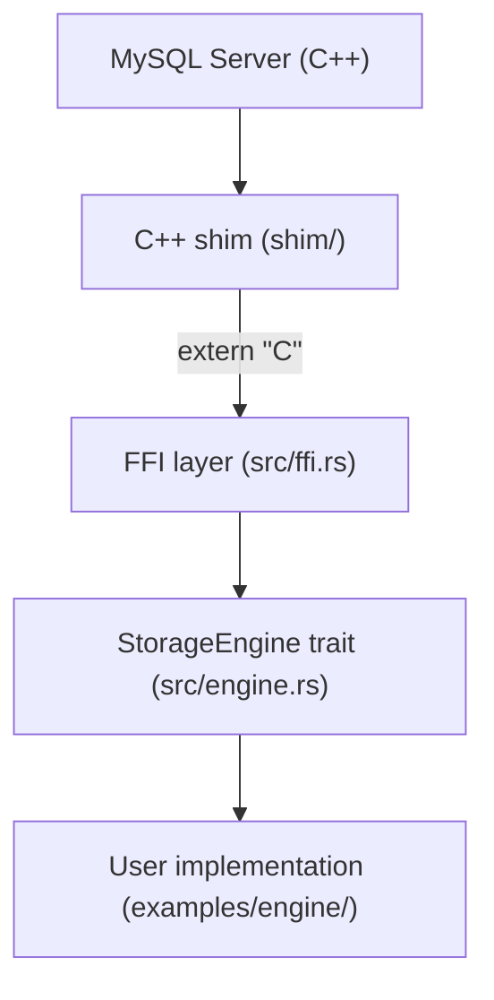
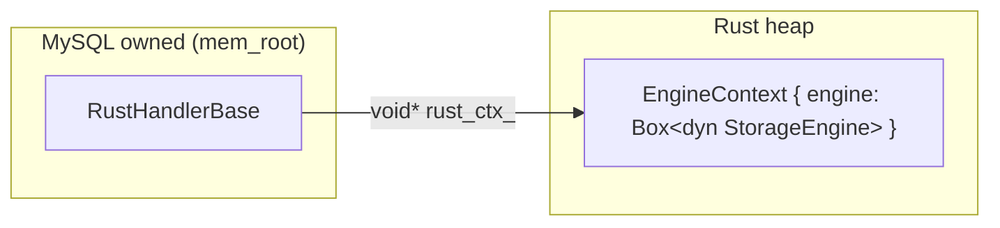
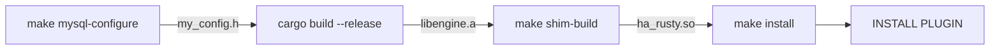

# Architecture

## Overview

Complete Rust bindings for the MySQL 8.4 LTS storage engine handler API.\
The goal is to bind every method in handler (158 virtual methods) and handlerton (93 callbacks).

## Layers

Four layers from the MySQL Server down to the user's Rust implementation.

### Layer 1: MySQL Server

The MySQL server itself. Allocates `handler` instances via `new (mem_root)` and calls virtual methods on them.\
 Not modified by this project.

### Layer 2: C++ shim (`shim/`)

C++ code that inherits the MySQL `handler` class.\
Bridges the MySQL Server and Rust.

| File | Role |
| --- | --- |
| `CMakeLists.txt` | Build configuration. MySQL header include paths, `ENABLE_RUST` option |
| `binding.hpp` | `RustHandlerBase` class declaration (inherits `handler`) |
| `binding.cc` | Delegates each virtual method to its `extern "C"` counterpart |
| `plugin.cc` | Plugin registration via `mysql_declare_plugin` macro |

Responsibilities:

- Override every `handler` virtual method and forward to the corresponding `extern "C"` function
- Hold a `void* rust_ctx_` member pointing to the Rust-side `EngineContext`
- Satisfy the ABI MySQL expects (plugin registration, `THR_LOCK` management)
- Contain zero Rust logic — pure delegation layer

Build artifact: `ha_rusty.so` (MySQL plugin)

### Layer 3: Rust crate (`src/`)

| Module | Role |
| --- | --- |
| `sys.rs` | Constants and opaque types generated by bindgen (`HA_ERR_*`, `TABLE`, `THD`, etc.) |
| `engine.rs` | `StorageEngine` trait definition (safe Rust interface) |
| `panic_guard.rs` | `ffi_boundary()` — `catch_unwind` + Result-to-errno conversion |
| `ffi.rs` | `#[no_mangle] extern "C"` callbacks called from the C++ shim |

### Layer 4: User implementation (`examples/engine/`)

A staticlib crate that implements the `StorageEngine` trait.\
Linked into the C++ shim as `libengine.a`.

## Pointer-based delegation

MySQL owns the `handler` memory. Rust-side objects live on the Rust heap, referenced from C++ via a `void*` pointer. Lifetime is managed by the constructor and destructor.

## Naming convention

| Direction | Pattern | Example |
| --- | --- | --- |
| C++ → Rust | `rust__handler__<method>` | `rust__handler__rnd_next` |
| Rust → C++ | `mysql__<Class>__<method>` | `mysql__TABLE__field_count` |

## Build flow

## Safety invariants

- All `extern "C"` callbacks must be wrapped with `ffi_boundary()` (`catch_unwind`).
  A panic would abort the entire MySQL Server.
- MySQL-owned pointers (`TABLE*`, `Field*`, `THD*`) must not be stored beyond
  the scope of a callback.
- C++ classes are represented in Rust as opaque types (`#[repr(C)] struct Foo([u8; 0])`).
- Struct size and alignment are verified with `static_assert` in `binding.cc`.
