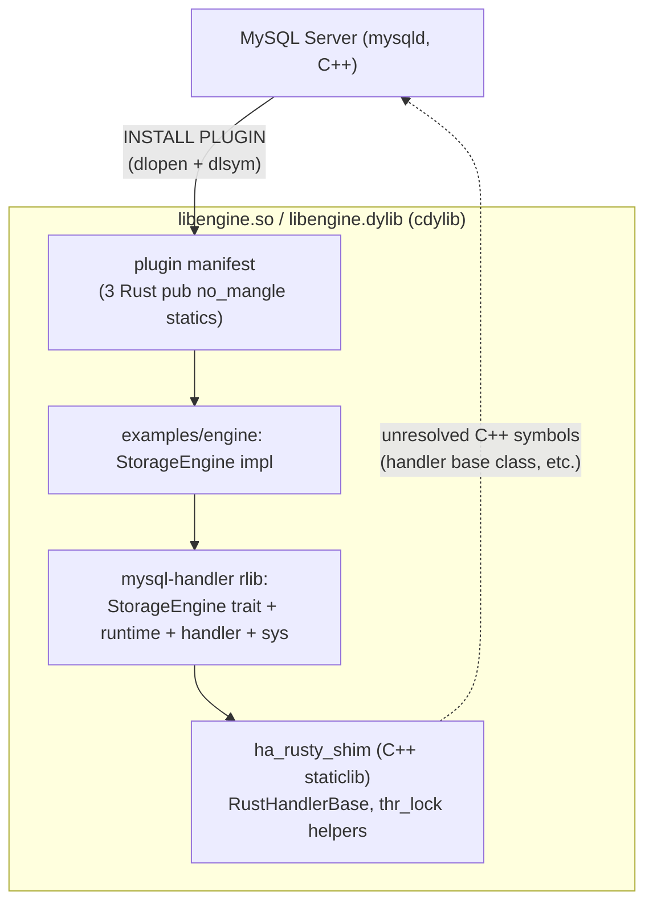

# Architecture

## Overview

Complete Rust bindings for the MySQL 8.4 LTS storage engine handler API. The goal is to bind every method in handler (158 virtual methods) and handlerton (93 callbacks).

## Layers

- **`shim/`** — C++ staticlib (`libha_rusty_shim.a`). Subclasses `handler`; each virtual method forwards to a `rust__handler__*` callback.
- **`src/`** — mysql-handler rlib. bindgen output (`sys.rs`), `StorageEngine` trait, `ffi_boundary()` (`catch_unwind`), per-method callbacks.
- **`examples/engine/`** — User cdylib. Implements `StorageEngine`; hosts the plugin manifest (see below).

## Plugin manifest in Rust

mysqld looks up three data symbols at `INSTALL PLUGIN` (`_mysql_plugin_interface_version_`, `_mysql_sizeof_struct_st_plugin_`, `_mysql_plugin_declarations_`). They live in Rust (`examples/engine/src/lib.rs::plugin_manifest`) as `#[unsafe(no_mangle)] pub static` because Rust's auto-generated cdylib version script wraps every non-`pub no_mangle` symbol in `local: *;` — any C++-side definition would be stripped from `.dynsym` and become invisible to `dlsym`. The manifest references `rusty_storage_engine` / `rusty_init_func` / `rusty_deinit_func` which still live in `shim/` with `extern "C"` linkage so Rust can name them.

## Pointer-based delegation

`RustHandlerBase` lives in MySQL-owned memory (mem_root). State that belongs to the Rust engine impl is boxed on the Rust heap (`EngineContext` wrapping `Box<dyn StorageEngine>`) and reached through `void* rust_ctx_`. The C++ constructor / destructor calls `rust__create_engine` / `rust__destroy_engine` to keep the lifetimes aligned.

## Naming convention

| Direction | Pattern | Example |
| --- | --- | --- |
| C++ → Rust | `rust__handler__<method>` | `rust__handler__rnd_next` |
| Rust → C++ | `mysql__<Class>__<method>` | `mysql__TABLE__field_count` |

## Build modes

`cargo build --release -p engine`. `src/sys_bindings.rs` is committed bindgen output, so `cargo check` / `cargo test` need no MySQL headers. Shim staticlib is selected by env var:

| Trigger | Behaviour |
| --- | --- |
| `MYSQL_HANDLER_FROM_SOURCE=1` | `cmake` builds `libha_rusty_shim.a` from `shim/` against the `mysql-server/` submodule |
| `MYSQL_HANDLER_ARCHIVE=<local path>` | gunzip the named archive into `OUT_DIR/prebuilt/libha_rusty_shim.a` (local filesystem only; `build.rs` never fetches) |
| (no env var) | No shim linking — fine for `cargo check` / `cargo test`, not loadable into mysqld |

Regenerate `src/sys_bindings.rs` with `MYSQL_HANDLER_REGEN_BINDINGS=1 cargo build -p mysql-handler` after `make setup`.

## Smoke testing

`make test_e2e` builds a two-stage Docker image (builder produces `libengine.so`; runtime is `mysql:8.4.9` with the plugin in `plugin_dir`), runs `INSTALL PLUGIN` + `tests/e2e/test.sql` via `docker exec`, and asserts the sentinel value. Building plugin and mysqld in the same Linux container avoids the host/container ABI mismatch (host-built Mach-O cannot be `dlopen`ed by Linux mysqld).

## Safety invariants

- All `extern "C"` callbacks must be wrapped with `ffi_boundary()` (`catch_unwind`). A panic would abort the entire MySQL Server.
- MySQL-owned pointers (`TABLE*`, `Field*`, `THD*`) must not be stored beyond the scope of a callback.
- C++ classes are represented in Rust as opaque types (`#[repr(C)] struct Foo([u8; 0])`).
- Struct size and alignment are verified with `static_assert` in `binding.cc`.
